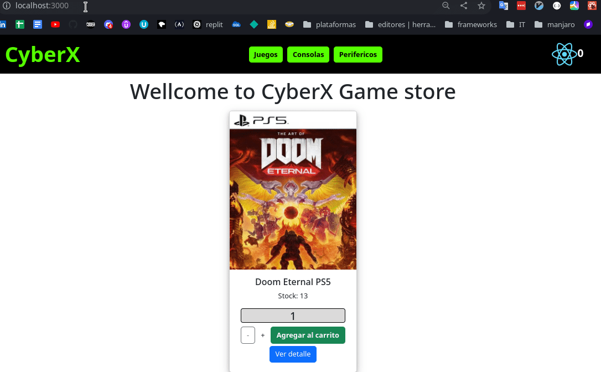

# CyberX - Tienda Gamer

---

Proyecto en construccion, curso React de CoderHouse 2022.

Se trata de un e-commerce de juegos y consolas.

## Logo

Diseño para el logo:

## Instalacion local

$ git clone [https://github.com/Melldy-Monteverde/projectreact](https://github.com/Melldy-Monteverde/projectreact)

$ cd projectreact

Para instalar las dependencias y levantar el servidor:

$ npm install

$ npm start

## Rutas definidas

Configuradas en App.js

1. La ruta "/" (por default) muestra el título de bienvenida y el listado de todos los productos (ItemListContainer).

2. La ruta "/categoria/:categoryID" muestra los productos filtador según cada una de las 3 categorías existentes: Juegos, Consolas, Perifericos. El componente tiene el nombre ItemListContainer + filtrado por categoria.

3. La ruta "/detalle/:productId" muestra el detalle del producto seleccionado mediante el link "ver más", ubicando el producto y asociado a su id.

4. La ruta "*" define que toda otra ruta a la que se quiera acceder mediante el navegador del browser (y no sea alguna de las anteriores), devuelva "404 - página no encontrada" junto al logo de la App.

5. Laruta "/cart", lleva al carrito de compras para ver el listado de productos agregados, donde se podra sumar, restar o eliminar productos por unidad, mismo vaciar el carrito. Tambien es posible navegar al catalo desde esta ruta, y en caso de qeu el carrito de compras este vacio, se indicara que no hay productos agregados y se habilita un boton para volver al catalogo.

## Detalles

Se utilizo React-bootstrap para algunos estilos, los mimosfueron modificados.

La visual de de toda la pagina ira cambiando a medida que se van agregando funciones y estilos, por ahora esta enfocada en funcionalidad.

## Screenshots

### Recorrido

### Home Page

### Rutas

### Not found 404

---

## Autor

[Melldy Monteverde](https://github.com/Melldy-Monteverde)